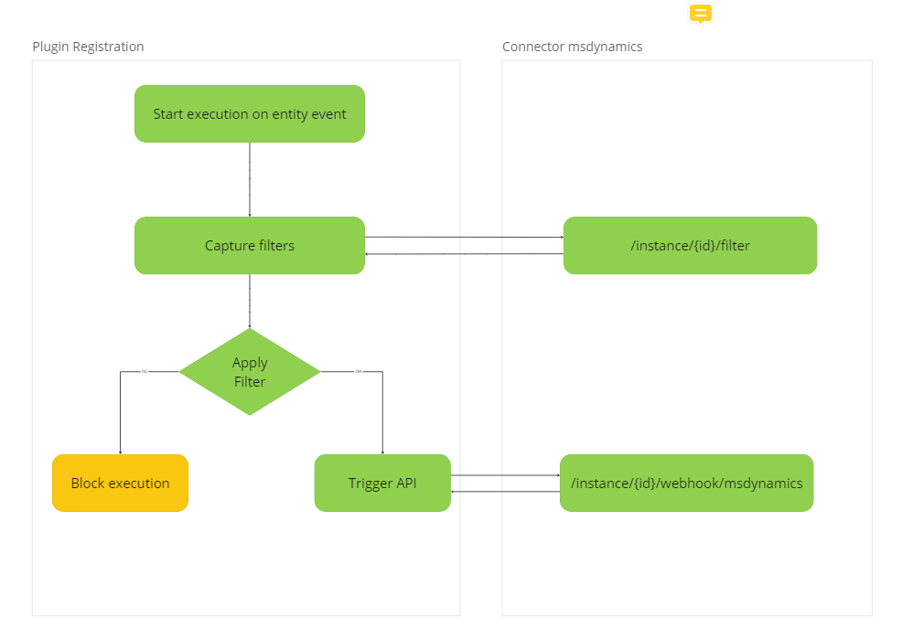

# Overview

This repository contains a msdynamics plugin architecture that allows you to execute the plugin in the plugin registration tool and perform the specific actions based on the plugin code.

## Table of Contents

- [Getting started](#getting-started)
- [Webhook and Plugins](#webhook-and-plugins)
- [Plugin prerequisites](#prerequisites)
- [How to register the plugin](#how-to-register-the-plugin-using-plugin-registration-tool)
- [How to add the filter or modify the existing filters](#how-to-add-the-filter-or-modify-the-existing-filters)
- [Plugin Registration using REST API ](#plugin-registration-using-rest-api)

## Getting Started
To use the dynamics-365-webhook-filter:

1. Download the [Git](https://git-scm.com/downloads) and [Visual studio 2017 or later version](https://visualstudio.microsoft.com/vs/community/).

2. Checkout [Repository](https://git.goboomtown.com/cloud-sdk/plugins/dynamics-365-webhook-filter.git).

## Webhook and Plugins

- Status:
- Deciders:
- Date:

**Technical Story:**

Identify webhook registration approaches with filter ability

## Context and Problem Statement

Identify ability to add filters before trigger msdynamics webhook to sync data to OvationCXM.

## Considered Options

- Plugins
- Workflow
- Webhook

## Decision Outcome

Chosen option: **Plugins**, because more advanced filtering capabilities, you might consider using plugins. Plugins allow you to execute custom code before or after certain events in Dynamics 365.
<br>

## Plugins

This diagram shows a high-level view of the plugin flow:


### Create a Plugin:

Develop a plugin using Visual Studio or another development tool.
Implement the logic to check the conditions before triggering the webhook.

### Prerequisites

- Administrator level access to a Microsoft Dataverse environment
- A model-driven app that includes the account and task tables.
- If you don't have a model-driven app that includes these, see [Build your first model-driven app from scratch](https://learn.microsoft.com/en-us/power-apps/maker/model-driven-apps/build-first-model-driven-app) for steps to make one in just a few minutes.
- Visual Studio 2017 (or later version).
- Knowledge of the Visual C# programming language.
- Plug-in Registration tool.

## How to register the plugin using plugin registration tool:-

You need to use Visual Studio to write a plug-in. Registering a plugin in Microsoft Dynamics 365 using the Plugin Registration Tool is a common and straightforward approach. Here are the general steps:

### Step 1: Download the Plugin Registration Tool

The Plugin Registration Tool is part of the Dynamics 365 SDK. You can download the SDK from here [Plugin registration tool](https://www.c-sharpcorner.com/article/how-to-download-the-dynamics-365-ce-plugin-registration-tool/).

### Step 2: Extract and Run the Plugin Registration Tool

- Extract the downloaded SDK to a local folder.
- Navigate to the **Tools\Microsoft.CrmSdk.XrmTooling.PluginRegistrationTool.9.1.0.187\tools** folder.
- Run the **PluginRegistration.exe** tool.

### Step 3: Connect to Your Dynamics 365 Instance

- Once you open the plugin registration tool application Click on **Create New Connection** in the top navigation tab in the Plugin Registration Tool.
- After clicking on this option popup will appear and options will appear for login, choose the **display list of available organizations** option and add the appropriate email and password.
- After logging in successfully you will be able to see the list of webhooks and assemblies if already created for that instance or organization.

### Step 4: Register a New Assembly (Plugin)

- In the Plugin Registration Tool, click on the **Register** option in the upper navigation tab.
- Click on **Register New Assembly**.
- Browse and select your plugin assembly file (DLL).
- To get this dll file you can go to the folder in which you have created the plugin and then ` \bin\Debug\yourpluginName.dll`select this file and the selected file's path you can see the **step 1** text box in the dialog. Make sure the dll which you uploads that should be **build** first and should not contain any error after building.
- Enter the necessary information, including the isolation mode, the location where the assembly should be stored.

**Note**: - For Microsoft 365 users, verify that the isolation mode is set to **sandbox** and the location to store the assembly is **Database**.

### Step 5: Register a New Step

- After registering the assembly, right click on registered plugin.
- Click on **Register New Step**.
- Select the plugin and choose the event you want to register the step for. e.g you want to trigger the event on creating the account so in the new step dialog choose **create** option in the message dropdown.
- Enter the necessary information, including the filtering attributes and like choose the **PostOperation** option for **event pipeline execution** section and **Asynchronous** execution mode.These options specifies that this step will execute after creating the account in the msdynamics. So after clicking on register new step button you will be able to see the step under plugin.

### Step 6: Test the Plugin

After creating the step, you can test the plugin by performing the actions that trigger the registered event in Dynamics 365.

### Step 7: Update and Deploy

- Once you have registered the assembly and steps, you may need to update the plugin if you make changes to it.
- Click on **Update** in the **Register** tab and select the updated DLL.
- Finally, click on **Deploy All** to deploy the changes to your Dynamics 365 instance.

## How to add the filter or modify the existing filters:-

path:- **dynamics-365-webhook-filter/Helpers/FilterHelper.cs**
```
public bool IsValid(IPluginExecutionContext context, IOrganizationService service)
{
    try
    {
        string requestName = context.MessageName.ToLower();
        Entity entity = (Entity)context.InputParameters["Target"];
        string entityName = entity.LogicalName;
        var model = PayloadHelper.PayloadTransform(context);

        if (entityName == Constant.entities.Case)
        {
            string accountId = String.Empty;
            if (EventType.RequestName.update.ToString() == requestName)
            {
                Entity caseId = (Entity)context.InputParameters["Target"];

                // Retrieving the customer id of the case using the case id
                Entity caseRecord = service.Retrieve(entityName, caseId.Id, new ColumnSet("customerid"));

                EntityReference customerRef = caseRecord.GetAttributeValue<EntityReference>("customerid");
                accountId = customerRef.Id.ToString();
            }

            if (EventType.RequestName.create.ToString() == requestName)
            {
                // Extracting the customer ID from the provided model data.  
                EntityReference customerId = (EntityReference)model["customerid"];
                accountId = customerId.Id.ToString();
            }

            if (accountId == "6f82d1a5-a8c5-ee11-9079-00224827244c")
            {
                return true;
            }
        }

        return false;
    }
    catch (Exception ex)
    {
        // Handle exceptions.
        throw new InvalidPluginExecutionException($"Filter error: {ex.Message}", ex);
    }
}

```
The above code snippet explains about the filter conditions and based on these conditions the webhook will be triggered. 
To add the new filters or modify the existing filters then you modify it in this **FilterHelper.cs** file.

path:- **dynamics-365-webhook-filter/Constants/Contant.cs**
```
using OvationCXMFilterService.Constants;

namespace OvationCXMFilter.Constants
{
    public static class Constant
    {
        public static EntityModel entities = new EntityModel { Customer = "account", Contact = "contact", Case = "incident" };

        /* 
         * To test purpose replace this webhookUrl with test url as https://webhook.site/ 
         * Replace {{orgId}} with actual orgId before deploy on production
         */
        public static string webhookUrl = "https://connector-msdynamics-api-pwgavvro5q-uc.a.run.app/api/webhook/msdynamics?orgId={{orgId}}";
    }
    
}

```
To add the new webhook url or to change the entity or add the new entity go to the **Constant.cs** file 

## Plugin Registration using REST API

### Step 1: Obtain OAuth Token

Before making requests to the Dynamics 365 Web API, you need to obtain an OAuth token. This typically involves sending a request to the token endpoint with your client ID, client secret, username, and password. Ensure that you have the required permissions to register plugins.

### Step 2: Register the Plugin Assembly

```
POST [Organization URI]/api/data/v9.1/pluginassemblies HTTP/1.1
Authorization: Bearer <your-access-token>
Content-Type: application/json

{
  "name": "YourPluginAssembly",
  "culture": 1033,
  "version": "1.0.0.0",
  "publickeytoken": "publickeytoken",
  "sourcetype": 0,
  "content": "Base64-encoded assembly content"
}
```

| Parameter      | Type   | Description                     |
| -------------- | ------ | ------------------------------- |
| name           | string | plugin assembly name            |
| publickeytoken | string | plugin assembly publickeytoken  |
| content        | string | Base64-encoded assembly content |

### Step 3: Register the Plugin Type

```
POST [Organization URI]/api/data/v9.1/plugintypes HTTP/1.1
Authorization: Bearer <your-access-token>
Content-Type: application/json

{
  "name": "YourPluginTypeName",
  "typename": "YourNamespace.YourPluginClass",
  "friendlyname": "Your Friendly Name",
  "_pluginassemblyid_value": "<plugin-assembly-id>"
}
```

| Parameter                | Type   | Description                     |
| ------------------------ | ------ | ------------------------------- |
| name                     | string | plugin type name                |
| typename                 | string | plugin assembly publickeytoken  |
| friendlyname             | string | Base64-encoded assembly content |
| \_pluginassemblyid_value | string | \_pluginassemblyid_value        |

### Step 4: Register the Step

```
POST [Organization URI]/api/data/v9.1/steps HTTP/1.1
Authorization: Bearer <your-access-token>
Content-Type: application/json

{
  "name": "YourStepName",
  "eventhandler": "1",
  "eventid": <event-id>,
  "mode": 0,
  "rank": 1,
  "stage": 40,
  "supporteddeployment": 0,
  "configuration": "{\"PluginTypeName\":\"YourNamespace.YourPluginClass\", ...}",
  "sdkmessagefilterid": {
    "@odata.type": "Microsoft.Dynamics.CRM.Sdk.Data.Services.EntityReference",
    "id": "<sdk-message-filter-id>",
    "logicalname": "sdkmessagefilter"
  }
}
```

| Parameter             | Type   | Description                                                           |
| --------------------- | ------ | --------------------------------------------------------------------- |
| name                  | string | step name                                                             |
| eventid               | string | the actual ID corresponding to the event you want to handle           |
| configuration         | string | step configuration                                                    |
| sdkmessagefilterid.id | string | the actual ID of the SDK message filter corresponding to your entity. |

## Artifacts

- https://learn.microsoft.com/en-us/power-apps/developer/data-platform/tutorial-write-plug-in
- https://learn.microsoft.com/en-us/power-apps/developer/data-platform/tutorial-debug-plug-in
- https://learn.microsoft.com/en-us/power-apps/developer/data-platform/tutorial-update-plug-in
